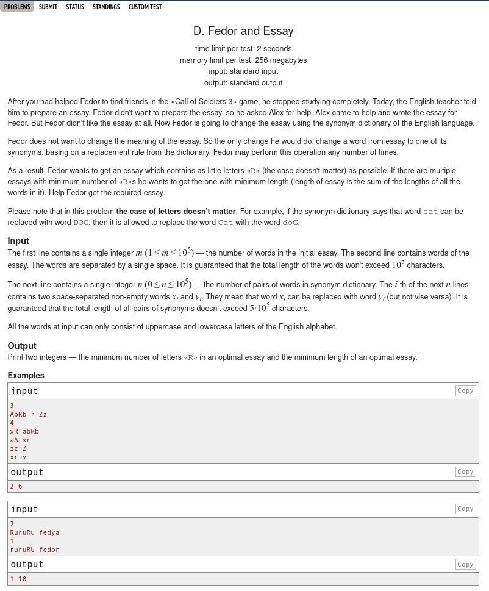

# PD_ExercCodeForce

**Conteúdo da Disciplina**: Programação Dinâmica 

## Alunos
|Matrícula | Aluno |
| -- | -- |
| 170122468  |  Nilvan Peres Costa |
| -  |  - |

## Sobre 
Esse projeto busca aplicar os conhecimentos adquiridos na matéria de Projeto de Algoritmos lecionada pelo professor Maurício Serrano, através da resolução de problemas do site Code Force.

## Screenshots

### Exercício 1 -[Knapsack](https://codeforces.com/contest/1132/problem/E)

- Descrição do problema:

- Logs de submissão:

  

### Exercício 2 - [Fedor and Essay](./assets/Explanation.png)
- Descrição do problema:

- Logs de submissão:

  

### Exercício 3 - [Consecutive Subsequence ](https://codeforces.com/problemset/problem/977/F)

- Descrição do problema:

- Log de submissão:

  

## Instalação 
**Linguagem**: Python 3 
**Framework**: (caso exista) 
**Pré-requisitos**: Python 3.8 ou superior 

## Uso 

Para submeter as resoluções dos exercicíos basta seguir os passos abaixo:

1. Acesse a pasta do exercício desejado;

2. No arquivo 'explicacao.md' clique em link do problema;

3. O código fonte do problema que possui a extensão '.py';

4. No site do code force, seleciona a linguagem Python 3.8.10 e selecione o arquivo com o código fonte;

## Outros 
O vídeo pode ser acessado através do
[Link]()
